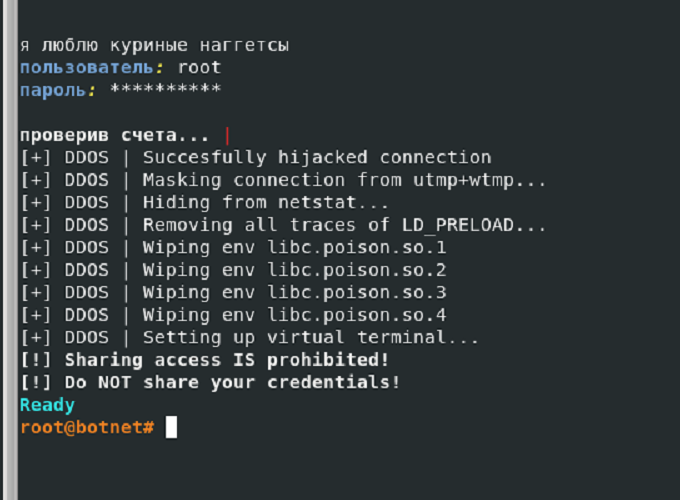
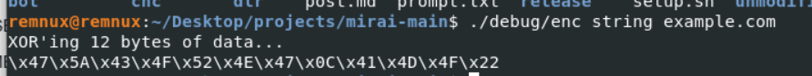
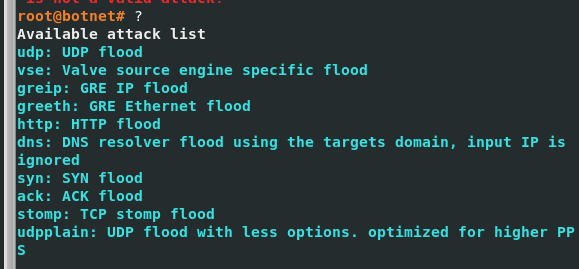
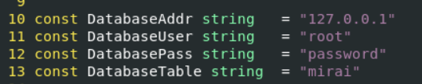
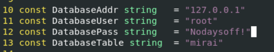
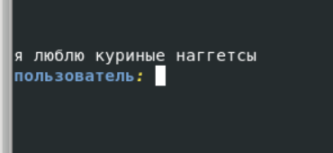

# 目次

1. [はじめに](#はじめに)
2. [Miraiって？](#Miraiって？)
4. [環境構築](#環境構築)
5. [動的解析](#動的解析)
6. [まとめ](#まとめ)
7. [参考文献](#参考文献)
8. [第二回へつづく](#第二回へつづく)

# はじめに
この記事は3部構成で、これは第一回の記事です。
第一回→動的解析
第二回→ソースコードの解析
第三回→Ghidraによる静的解析　←イマココ

今回は前回に引き続き、Miraiの検体を解析していきます。最終回の今回は、Ghidraを使った静的解析を行い、ソースコードでハードコーディングされていた接続先のIPアドレスやドメイン名等のIoCに加え、Miraiのbotがどのような動きをするかをGhidraから解明していくまでを範囲としています。

※本投稿は悪意のある行為を助長するためのものではなく、あくまでマルウェアの挙動を学習したい方やマルウェア解析者を対象としたものです。また、本投稿は特定の誰かの行動を支持したり批判したりすることは一切なく、常に中立の第三者としての発言に基づいています。


## 参考にしたサイト
- 

## 解析対象のファイル

ソースコードでbotに当たる部分を解析する

## 前回のおさらい
Miraiのbotとなる部分は、コンパイル時に**strip**コマンドを使う等して、

## REMnux上での解析を開始

## ハッシュ値等の基本情報

## VirusTotal
ハッシュ値をもとに既知のマルウェアであれば検出できる。
今回は自分でハードコードされている値を多少変えたりしていることもあり、ハッシュ値からは検出されず。


## fileコマンド
32bitのARM実行ファイル、ELF


## readelf
ヘッダー情報を表示する
```
readelf -e -W dvrhelper
```

注目ポイント↓
```
Machine: ARM
Entry point address: 0x10a61
```



## wxHexEditor
editorで見ても先頭はELF。
ちなみにバイナリ上でのELFファイルのマジックナンバーは**7F 45 4C 46**


## Strings

ファイル内のprint可能な文字列を出力する。
ここで出力される文字列がほぼ難読化されているとかだと、パッキングされている可能性があるため、解析前にアンパックする必要がある。
（普段.exeのファイルを調査するときはFlossを使ってる）
```
strings dvrHelper
```

パッキングされていないので文字列がよく見える。
また、表示される文字列はツールによって違う。Flossが一番色々な文字列が見えるらしい、、

以下、面白そうな文字列
```
HTTP/1.1
User-Agent:
Host:
Cookie:
http
url=
POST
JR**@
/proc/net/tcp
/dev/watchdog
/dev/misc/watchdog
offset >= oldend

```

## DIE
パッカーを検出してくれる。
見た感じパッキングされていない。だが、ここでパッキングされていないからといってパッカーが使われていないとは限らないことに注意。
UPXみたいな有名どころは検出するけど、マイナーな奴は検出しない。
ただ今回は、ソースコード見た時も自分でdvrHelperをコンパイルするときもパッカー使っていないのでとりあえずよし。


Entropyは0～8の間で、文字列の不規則性を表す。値が大きいほど文字列が不規則であり、難読化およびパッキングされている可能性が高いと判別される。
今回はパッキングしていないがパッキングされていると判定されている。


## Noriben
無理。

# 最難関 Ghidra

